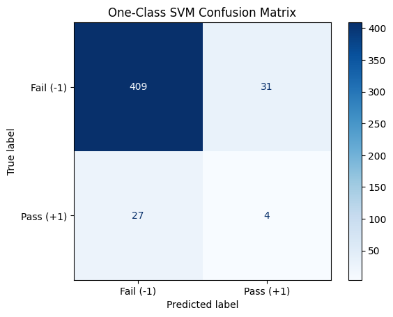

# Semiconductor Manufacturing Fault Detection

## 1. Project Objective
This project uses sensor data from a semiconductor manufacturing process to detect faulty products through unsupervised anomaly detection. The goal is to analyze the complex dataset, handle its challenges like missing values and class imbalance, and evaluate the performance of different machine learning models.

## 2. Data Source & Technologies
* **Dataset:** [SECOM Dataset from UCI ML Repository](https://archive.ics.uci.edu/dataset/179/secom)
* **Technologies:** Python, Pandas, Scikit-learn, Matplotlib, Seaborn, Jupyter Notebook.

## 3. Project Workflow
The project followed a standard data science methodology:
1.  **Data Cleaning:** Analyzed missing data and removed features with over 50% null values. Imputed the rest using the median.
2.  **Exploratory Data Analysis (EDA):** Discovered a **severe class imbalance**, with only ~7% of outcomes being 'Pass' (+1). This finding was critical for model evaluation.
3.  **Data Preparation:** The cleaned data was split into stratified training (70%) and test (30%) sets to maintain class distribution. Features were then scaled using `StandardScaler`.
4.  **Modeling:** Two unsupervised models, `Isolation Forest` and `One-Class SVM`, were trained on the prepared data.

## 4. Results & Analysis
Model performance was evaluated based on `Recall` for the minority 'Pass' class, as `Accuracy` is a misleading metric for this imbalanced dataset.

### Isolation Forest
The model was effective at identifying the majority 'Fail' class but struggled to correctly identify the rare 'Pass' class, capturing only **16%** of them (Recall = 0.16).

### One-Class SVM
This model showed a similar pattern but performed slightly worse, with a **Recall of 13%** for the 'Pass' class.

### Conclusion
| Metric (for "Pass" Class) | Isolation Forest | One-Class SVM |
| :------------------------ | :--------------: | :-------------: |
| **Recall** |    **16%** |       13%       |
| **F1-Score** |    **0.17** |      0.12       |

While both models found the task challenging, **Isolation Forest** was the better-performing model. The results highlight the difficulty of anomaly detection in a noisy, high-dimensional, and imbalanced dataset.

## 5. Future Improvements
* **Data Balancing:** Use techniques like SMOTE on the training data.
* **Dimensionality Reduction:** Apply PCA to reduce the feature space.
* **Alternative Algorithms:** Explore models like Local Outlier Factor (LOF) or Autoencoders.

## 6. How to Run
1.  Clone the repository and install dependencies: `pip install -r requirements.txt`
2.  Run the Jupyter Notebooks in order: `01_Data_Exploration.ipynb`, then `02_Modeling.ipynb`.